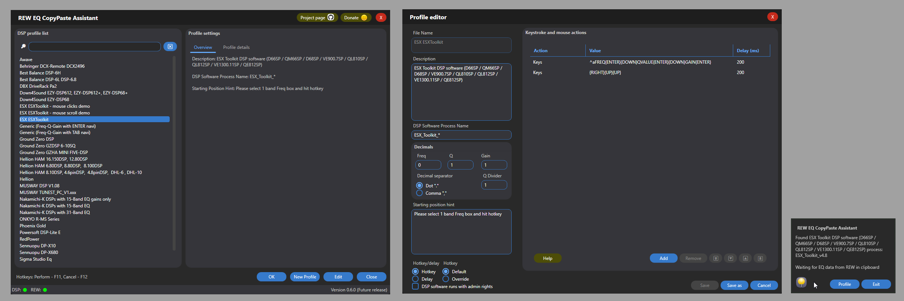
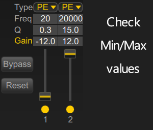
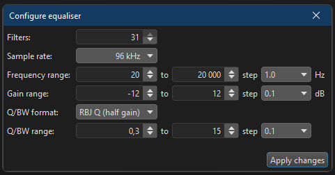

### 03.01.2026
ver 0.6.0 
New Year - New UI!

### 16.12.2025
ver 0.5.3 
Mutex release error fixed 
Aded flags for DSP and REW processes check skip in the Config.json 

### 11.12.2025
ver 0.5.2 
Delay confirmation dialog dynamic size to fit the starting position hint. 
QDivider field size increased in the editor window 
Nakamichi profiles QDivider set to 0.707 as confirmed with @vasiljevvv  

### 10.12.2025
ver 0.5.1 
Bugfix: fixed an issue UI form update of Hotkey/Delay preference; editor focus on keystroke enables save button 

### 09.12.2025
ver 0.5.0 
The mouse cursor now visibly moves to the specified position before clicking, making its location clear 
Implemented functionality for mouse scrolling, example profile `ESX ESXToolkit - mouse scroll demo.json` 
Removed unused functions and performed code cleanup 
Renamed files and functions for better clarity 
Windows centered 
Profile selection button in popup 
Future releases: Mouse dragging (left/right mouse button hold and release) - functions are ready. Need to implement in a form 

### 04.12.2025
Profiles added: 
RedPower RP_DSP (IMPERATOR, YAKUZA, DSP8CH) 
Ground Zero GZHA MINI FIVE-DSP_GUI 
Ground Zero GZDSP 6-10SQ (GZDSP 6-10SQ) 
 
JL TwK VXi, MVi  have 10 band eq, and it is not possible to automate as it always rearranges bands once you change Freq of a given band and jumps all over window. Even with the mouse actions it is hard to understand where a given band will change position to. 
GZDSP-4.80A PRO ground zero rquires mouse scroll actions, will be implemented on upcoming versions

### 03.12.2025
ver 0.4.0 
Floating small semi-transparent window to show notifications instead of Windows pop-ups with a stop tool button. **Why?** Standard Windows pop-ups play notification sounds, which may go to speakers while you configure your system. Additionally, there is no way to configure timeouts for them, and they do not appear quickly one after another. With the custom notification window, the look and feel are improved now. 
Hotkeys are now more responsive. Previously, there was a timing issue with hotkey reactions (a fast hit on a hotkey was not triggering actions). 
Removed confusing REW API mode and a warning message if REW run in the regular mode as API mode gives no any benefits in terms of user experience and would create extra complexity in both code and UX. 

### 29.11.2025
ver 0.3.2 
Last used profile selected automatically on the next startup 
UI fixes 
Profile filter/list fix after a new profile created. Clear filter btn now also refreshes the list 
Code cleanup 

### 28.11.2025
ver 0.3.1 
Profile editor GUI window corrected sizing

### 27.11.2025 
ver 0.3.0: 
Added tabs with Profile Overview and Details  
ver 0.2.2: 
Added filter for searching profile in the profile selection window. 
Added a [guide for REW EQ config](Documentation/REW%20EQ%20Config%20Guide.md). 
Changed tool's versioning format 
DBX DriveRack Pa2 profile added 

### 25-11-2025:

Added statuses for DSP software and REW reflecting if they are running or not 
Added tooltips for GUI elements 
Added AdminRightsRequired flag in profile edit GUI 
Transposed output removed from console output 

### 20-11-2025:

⭐ NEW! Big update - Profile editor GUI implemented. It can be used for editing existing profiles (instead of manual edits of JSON files), saving existing profiles as templates to new profiles. 
Behringer DCX-Remote DCX2496 profile added - needs to be tested, Powersoft DSP-Lite E updated - thanks Salvo Garà

### 18-11-2025:
Down 4 Sound profiles added - EZY-DSP68, EZY-DSP612, EZY-DSP68+, EZY-DSP612+ 
Sigma studio profile hint updated. (In any way needs to reviewed again) 
Added Sennuopu DP-X10 
Added Hellion profiles for HAM 6.80DSP, HAM 8.80DSP, HAM 8.100DSP, HAM 8.10DSP, 4.6pinDSP, 4.8pinDSP, DHL-6 , DHL-10, HAM 16.150DSP, HAM 12.80DSP 

### 17-11-2025:
Admin rights validation added (in case if they're needed) 
Freq decimals added, some DSP software stucks on input if for example it does not allow you input decimals in Freq box, but you're using Generic/Generic or Generic/Exetended EQs which put extra zeroes at the end of Freq. 
👍 Thanks to Salvo Garà a new profile added for the Sigma studio (adau1701 processors) and t.racks DSP 4x4 Mini Editor V1.05. Home audio enthusiasts joined us! 
Added `Generic` profiles, TAB navigated and ENTER navigated. 
Double click action on selected profile open, no need to click OK after selection. 
JSON profile file format validation on load. Intentionally corrupted profile in ./DSPProfiles/Examples 
Best Balance DSP-6H profile added  
Best Balance DSP-6L DSP-6.8 profile added  

### 16-11-2025:

Added Awave DSP profile for variety of models 
Tests with Zapco DSP software  showed we need a new variable for each band with the band number. The keyword for it in keystrokes is `BANDNUMBER`. The reason - with Zapco software you have to select band by typing its number (handy, innit?). So I updated the main script to work with the new variable, updated the module which parses data from REW. During testing also noticed weird behaviour as in the DSP software decimals number and step settings, so I eventually come up with the following Configurable PEQ in REW: 
 
And only after this it started to work fine. So for now ADSP series is fine.
 Profile for ONKYO R-MS Series , models: R-MS66, R-MS55, R-MS25, R-MS10 - this is the first DSP software which runs under admin rights, so the CopyPaste tools in a such case also require to be running with admin rights, otherwise it won't be able to send input keys to DSP software.

### 14-11-2025:
MUSWAY TUNEST_PC_V1.* Profile added , DSPs list: M4 / M4+V3 / M4+V4 / M6V3 / M6V4 / D8V3/ D8V4 / DSP68 / TUNE12 / M6PRO / M12 / M5 / M10 / M8
Added 3 separate profiles for Nakamichi-K DSP software : 
Nakamichi-K 31-Band EQ with ONLY GAINS (NDSK4265AU) 
Nakamichi-K 15-Band EQ (NDSK4065AU / NDSK4165AU) 
Nakamichi-K 31-Band EQ (NDSK4085AU / NDSK4185AU / NDSK4285AU) 
For Nakamichi keep eye what it performs, I tried to implement some workarounds in the profile. Timeouts tweaking may be needed in your case.

### 13-11-2025:
Hotkeys now as an option to start input (delay option remains in the script, but now it depends on how profile is configured).
Global config with default values.
Musway DSP v1.08 profile added (M4+ / M6 / M6v2 / DSP68PRO) 

### 12-11-2025:
GUI for profile selection added. Event notification popups added. GUI demo 
Increased Phoenix Gold timeout before input as DSP software for some reason restores windowed mode instead of staying in maximized mode.

### 11-11-2025:
Tested Phoenix Gold software with mouse'n'keyboard input 

### 10-11-2025:
Back on track - account has been unblocked.
Implemented psm modules and floating point rounding, configurable decimal separator.
Testing in excel was not a bad idea, currently testing mouse operations, this will cover majority of DSPs.

### 09-11-2025:
Working on new features and testing the tool with variety of DSP software. I'll open donates just not to miss the train, absolutely not necessary from your end, but I will be happy.

### 08-11-2025:
Great news! I’ve received positive feedback — a few people have already tested the tool, and the responses are encouraging.
There are, however, some questions regarding certain DSP software (**Awave**, **Musway**, and **Nakamichi**). In these programs, navigating through bands with the `{TAB}` key doesn’t move to the next setting within the same band; instead, it jumps to the next band. For example, it loops through all Freq values first, then all Q values, and finally all Gain values. To handle this behavior properly, some adjustments in the code will be needed. 
Another thing worth mentioning: in some DSPs, when you place the cursor in a field (for example, Freq), the text inside isn’t automatically selected. As a result, typing or pasting will append characters to the existing text instead of replacing it. To avoid this, you can send the `^a` keystroke (which corresponds to Ctrl+A) to select all text in the field before typing or pasting.

### 06-11-2025:
Changed the QDivider value in the ESXToolkit.json profile to 1, as tests in the car showed that the actual Q format is RBJ Q (Half Gain). The visual EQ graph in ESX Toolkit may be misleading. It seems the GUI developers might not have consulted the hardware team regarding the algorithm used to generate the graph. 
For proper AutoEQ in REW that works correctly with your DSP, you need to determine the minimum and maximum values for Frequency, Q, and Gain, and then create a configurable EQ in REW.  
Let’s take ESX Toolkit as an example:

In a such case REW will calculate EQ using correct EQ filters which suit for ESX Toolkit.  
Side note: ESX Toolkit won’t allow you to enter values outside the supported range. For example, if you’re adjusting the Gain of a selected band and try to input -13, it will accept -1 and then stop—you won’t be able to type the 3, and the value will remain -1 (since the minimum allowed value is -12).  
This is why a configurable EQ in REW is necessary; otherwise, the tool would paste incorrect filters into the DSP.