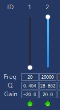
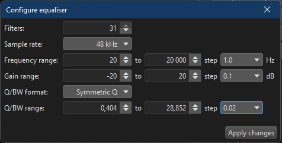

# REW EQ Config Guide

In the EQ section of REW, you can select which brand/model of DSP you have. Owners of Helix, Audison/Hertz, Mosconi, and other supported devices are somewhat fortunate - predefined presets for filter formats and parameters are already available for them. 
The remaining users will need to use the Generic profiles. There are three types available: Generic/Generic, Generic/Extended, and Generic/Configurable PEQ. 

The last option is more advanced and allows fine-tuning of the EQ profile according to the capabilities of your DSP. Note: Unlike the Extended type, it offers only PK filters, which may not be sufficient for advanced tuning, but they are adequate for most EQ tasks (including auto-EQ) based on a given measurement.

If the Generic or Extended EQ settings in REW do not match for your DSP, you should use Configurable PEQ. Before applying EQ - whether manually or using “Match response to target” - you have to verify EQ band parameters in your DSP software or specification. 
To do this, take one of the EQ bands in your DSP and adjust its values to observe how it behaves:
| Parameters | Where to check |
| :---- | ---- |
| Min/Max values for Freq, Q and Gain | in DSP specs or DSP software |
| Number of decimals for Freq, Q and Gain | in DSP specs or DSP software |
| Steps for Freq, Q and Gain | in DSP software |
| Number of EQ bands | in DSP specs or DSP software |
| Sample rate | in DSP specs |
| Q/WB format | In most DSPs, the filter type is RBJ/Q (half-gain). However, this is often unclear and rarely stated in the device specifications. Read below... |

To determine the correct Q/WB format you will need to perform test measurements using different options and compare the actual results with the predicted curves. Do not rely on the graphical interface of your DSP software - its visualization may differ significantly from what the DSP actually applies. If the filter shape is correct but appears too wide or too narrow, you can compensate using the QDivider parameter in the assistant tool. This parameter adjusts Q values during the copy/paste process. 
By default, QDivider is set to 1, meaning the Q value remains unchanged. 
- Setting QDivider to a value less than 1 results in higher Q values being pasted into your DSP software (narrower filters).
- Setting QDivider to a value greater than 1 results in lower Q values being pasted (wider filters).

Let’s take ESX Toolkit software with D68SP DSP as an example: 
31-band EQ, 96kHz sample rate, RBJ Q format 

    
    

 
Another example: 
Nakamichi-K softwre with NDSK4285AU DSP. 
31-bands EQ. 48 kHz sample rate. Symmetric Q. And after test measurements it turned out QDivider has to be 0.5 so in DSP software Q values will be multiplied by 2. 

    
    

EQ settings from REW help for reference:

**Generic / Generic**

As per REW help, Generic EQ settings allows 20 parametric filters. The adjustment ranges are: 
| Parameter | Minimum | Maximum | Resolution |
| :---- | ---- | ---- | ---- |
| Frequency | 10 | 22000 | 0.01 Hz below 100 Hz, 0.1 Hz below 1 kHz, 1 Hz above 1 kHz |
| Gain | -120 | +30 | 0.1 dB |
| Q | 0.1 | 50 | 0.001 |

**Generic / Extended**

The Extended equaliser offers the capabilities of the Generic equaliser but adds higher order filter choices, including shelf, low pass and high pass filters with slopes up to 48 dB/octave.

**Generic / Cofigurable PEQ**

The Configurable PEQ equaliser offers peaking filters but with the number of filters and the range and resolution of the parameters chosen by the user. 
   
The bandwidth of the peaking filters depends on the format selection. 
| Q/BW format | Bandwidth at half gain |
| :---- | ---- |
| RBJ Q | centre frequency/Q |
| Classic Q | sqrt(gain)*centre frequency/Q |
| Symmetric Q | sqrt(absgain)*centre frequency/Q |
| BW octaves | Bandwidth is in octaves |
"absgain" refers to using the absolute value of the dB figure so is always >= 1