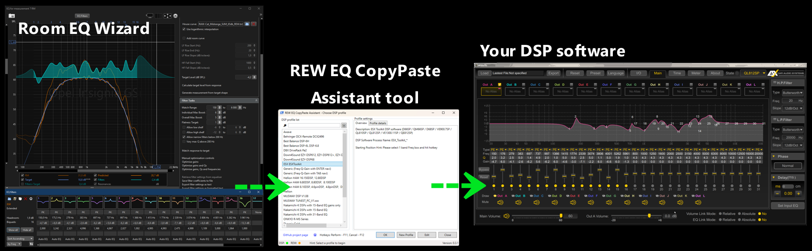

# REW-EQ-CopyPaste-Assistant

# Description

This tool allows you to transfer EQ filters for Room EQ Wizard (REW) to your DSP software EQ filters with ease. 
 
It assists with the EQ copy-paste procedure from REW software into your DSP app's EQ filters. You just need to run it in the background while applying EQ filters to your measurements in REW. When you are ready with EQ filters, hit the "Copy" button in the EQ filters section of REW. This tool will then prompt you to confirm if you want to paste the copied data into your DSP app. After your confirmation, it will bring the DSP process to the foreground, and you will need to click on the first band where the keystroke sequence will start to paste the data.
 
This is just an initial version of the tool. Experiment with it, create your own DSP profiles, and have fun!
Strong suggestion, when you create profile for a DSP which doesn't fully support keyboard navigation and you are dealing with mouse moves and clicks and you would like to share your profile with others - leave the DSP app in its native resolution, don't make it maximized to a full screen (on different devices screen resolution may vary).
Once you tested your own DSP profile please share it in the Discussion section of the repository so it will be added to the repo.

A demo video [ watch on YouTube](https://youtu.be/nAJcuQtrowY)

☕ Support this project **[ PayPal](https://paypal.me/IvanBakhmutovDonate)**

Special thanks to Denis GS for the ideas and collaboration!

## REW EQ Config Guide

Before applying EQ filters to your measurements in REW make sure that EQ settings are correct. [Guide](Documentation/REW%20EQ%20Config%20Guide.md)

## DSP Profile file format

The tool uses its own profiles (in JSON format), which store the DSP software application name (wildcards `*` are accepted), the keystroke sequence for inputting the data into the DSP. Check the examples in the `./DSPProfiles` folder. Keystroke sequences can contain mouse move and click actions and key actions like `{ENTER}`, `{RIGHT}`, `{LEFT}`, `{UP}`, `{DOWN}`, `{TAB}`, etc., depending on how navigation through EQ bands is implemented in your DSP software. [More details](Documentation/DSPProfileFileFormat.md)

### Tested profiles

| Brand | DSP Software | Requires admin rights | DSP devices |
| :---- | ---- | ---- | ---- |
| Generic profile | (No specific app) | ❎ | May work on some DSPs as is or after some keystroke adjustments. It just types wherever you want, for instance in notepad |
| ESX | ESX Toolkit | ❎ |D66SP, QM66SP, D68SP, VE900.7SP, QL810SP, QL812SP, VE1300.11SP, QE812SP |
| Hellion | Hellion DSP software | ❎ | (to be verified) |
| Musway | MUSWAY DSP V1.08 | ❎ | M4+, M6, M6v2, DSP68PRO |
| Musway | MUSWAY TUNEST_PC_V1.* | ❎ | M4, M4+V3, M4+V4, M6V3, M6V4, D8V3, D8V4, DSP68, TUNE12, M6PRO, M12, M5, M10, M8 |
| Nakamichi | Nakamichi-K | ❎ | NDSK4265AU |
| Nakamichi | Nakamichi-K | ❎ | NDSK4065AU, NDSK4165AU |
| Nakamichi | Nakamichi-K | ❎ | NDSK4085AU, NDSK4185AU, NDSK4285AU |
| Phoenix | Phoenix Gold DSP software | ❎ | (to be verified) |
| Sennuopu | Sennuopu DP-X680 PC Software EN | ❎ | DP-X680 |
| Zapco | PC Program (Windows) for ADSP series | ❎ | ADSP-Z8 IV AT, ADSP-Z8 IV-6AT, ADSP-Z12 IV-10A, ADSP-Z16 IV-12A |
| Awave | DSP PC Tool | ❎ | DSPA6, DSP12DMAX, DSP16DMAX, DSPA6II, DSP6V5, DSPM6, DSPA8D, DSPA10II, DSP10D, DSP10DMAX, DSPT10, DSP8.1, DSPA12, DSPA12D, DSPA12D PRO, DSP12DMAXII, DSPA16D, DSPA16DMAXII,DSPA24D |
| ONKYO | R-MS Series | 🚩 | R-MS66, R-MS55, R-MS25, R-MS10: Important - DSP software runs with admin rights, so CopyPaste tool should be running with admin rights as well |
| the t.racks | DSP 4x4 Mini Editor V1.05 | ❎ | DSP 4×4 Mini |
| Sigma | Sigma Studio | ❎ | adau1701 processors |
| Best Balance | DSP_BestBalance | 🚩 | DSP-6L, DSP-6.8 |
| Best Balance | BestBalance V2 | ❎ | DSP-6H |
| Down 4 Sound | EZY-DSP68 | ❎ | EZY-DSP68 |
| Down 4 Sound | EZY-DSP6* | ❎ | EZY-DSP612, EZY-DSP68+, EZY-DSP612+ |
| Sennuopu | Sennuopu DP-X10 | ❎ | DP-X10 |
| Hellion | HAM8.80DSP | ❎ | HAM 6.80DSP, HAM 8.80DSP, HAM 8.100DSP |
| Hellion | HAM8.10DSP | ❎ | HAM 8.10DSP, 4.6pinDSP, 4.8pinDSP, DHL-6, DHL-10 |
| Hellion | HAM16.150DSP | ❎ | HAM 16.150DSP, HAM 12.80DSP |
| Behringer | DCX-Remote | ❎ | DCX2496 |
| DBX | pa2ui | ❎ | DriveRack Pa2 |
| Powersoft | ArmoniaPlus | ❎ | DSP-Lite E |
| RedPower | RP_DSP | ❎ | IMPERATOR, YAKUZA, DSP8CH |
| Ground Zero | GZHA MINI FIVE-DSP_GUI  | ❎ | GZHA MINI FIVE-DSP |
| Ground Zero | GZDSP 6-10SQ | ❎ | GZDSP 6-10SQ |

## Project plans
Completed tasks and upcoming plans in [TODOs.md](TODOs.md)

## Recent updates
### 11.12.2025
ver 0.5.2 
Delay confirmation dialog dynamic size to fit the starting position hint. 

### 10.12.2025
ver 0.5.1 
Bugfix: fixed an issue UI form update of Hotkey/Delay preference; editor focus on keystroke enables save button 

### 09.12.2025
ver 0.5.0 
The mouse cursor now visibly moves to the specified position before clicking, making its location clear 
Implemented functionality for mouse scrolling, example profile `ESX ESXToolkit - mouse scroll demo.json` 
Removed unused functions and performed code cleanup 
Renamed files and functions for better clarity 
Windows centered 
Profile selection button in popup 
Future releases: Mouse dragging (left/right mouse button hold and release) - functions are ready. Need to implement in a form 

### 04.12.2025
Profiles added: 
RedPower RP_DSP (IMPERATOR, YAKUZA, DSP8CH) 
Ground Zero GZHA MINI FIVE-DSP_GUI 
Ground Zero GZDSP 6-10SQ (TuN software) 
 
JL TwK VXi, MVi  have 10 band eq, and it is not possible to automate as it always rearranges bands once you change Freq of a given band and jumps all over window. Even with the mouse actions it is hard to understand where a given band will change position to. 
GZDSP-4.80A PRO ground zero rquires mouse scroll actions, will be implemented on upcoming versions

### 03.12.2025
ver 0.4.0 
Floating small semi-transparent window to show notifications instead of Windows pop-ups with a stop tool button. **Why?** Standard Windows pop-ups play notification sounds, which may go to speakers while you configure your system. Additionally, there is no way to configure timeouts for them, and they do not appear quickly one after another. With the custom notification window, the look and feel are improved now. 
Hotkeys are now more responsive. Previously, there was a timing issue with hotkey reactions (a fast hit on a hotkey was not triggering actions). 
Removed confusing REW API mode and a warning message if REW run in the regular mode as API mode gives no any benefits in terms of user experience and would create extra complexity in both code and UX. 

[Full change log...](Documentation/Changelog.md)

## Q&A

Isn't it better to do manipulations with imported DSP filters file directly? The answer is - no. You shouldn’t mess with an imported DSP settings file — it’s safer that way and helps avoid file corruption. Just watch what’s being passed to the filters. Some DSP files aren’t plain text; for example, ESX settings files are password-protected and look binary inside.  
Why it is written in PowerShell? - It is lightweight, open-source, no need in binaries, works on old computers (starting from Windows 7) and why not?